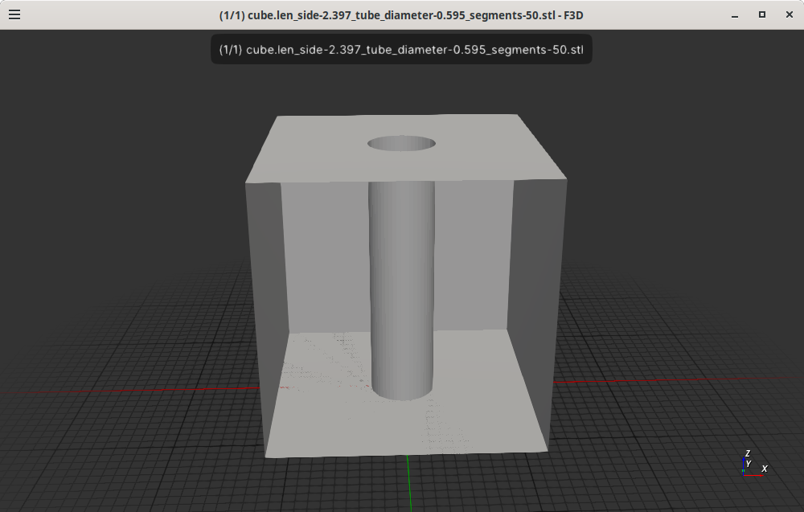

# refr-cubes

This is cubes but I've refactored out create_text as
I'm going to create diameter on one side and on another
side of the cube will be the number when I create the 8
R_E_R_F cubes.

## Current status

New algorithm from the bot but it doesn't work yet. The
final cube has no diameter text and polygon 2 is missing:

```
wink@3900x 25-03-29T18:18:17.465Z:~/data/prgs/3dprinting/rerf-cubes (rotate-before-translation-and-then-extrude)
$ cargo ru^C
wink@3900x 25-03-29T18:18:21.128Z:~/data/prgs/3dprinting/rerf-cubes (rotate-before-translation-and-then-extrude)
$ RUST_BACKTRACE=1 cargo run 2.397 -m 0.595
    Finished `dev` profile [unoptimized + debuginfo] target(s) in 0.09s
     Running `target/debug/rerf-cubes 2.397 -m 0.595`
true
polygon 0:
 vertices count: 4
  vertex 0:
     pos: [0.0, 0.0, 0.0]
     normal: [[-0.0, -0.0, -1.0]]
  vertex 1:
     pos: [0.0, 2.397, 0.0]
     normal: [[-0.0, -0.0, -1.0]]
  vertex 2:
     pos: [2.397, 2.397, 0.0]
     normal: [[-0.0, -0.0, -1.0]]
  vertex 3:
     pos: [2.397, 0.0, 0.0]
     normal: [[-0.0, -0.0, -1.0]]
 plane: Plane { normal: [[0.0, 0.0, -1.0]], w: 0.0 }
polygon 1:
 vertices count: 4
  vertex 0:
     pos: [0.0, 0.0, 2.397]
     normal: [[0.0, 0.0, 1.0]]
  vertex 1:
     pos: [2.397, 0.0, 2.397]
     normal: [[0.0, 0.0, 1.0]]
  vertex 2:
     pos: [2.397, 2.397, 2.397]
     normal: [[0.0, 0.0, 1.0]]
  vertex 3:
     pos: [0.0, 2.397, 2.397]
     normal: [[0.0, 0.0, 1.0]]
 plane: Plane { normal: [[0.0, 0.0, 1.0]], w: 2.397 }
polygon 2:
 vertices count: 4
  vertex 0:
     pos: [0.0, 0.0, 0.0]
     normal: [[-0.0, -1.0, -0.0]]
  vertex 1:
     pos: [2.397, 0.0, 0.0]
     normal: [[-0.0, -1.0, -0.0]]
  vertex 2:
     pos: [2.397, 0.0, 2.397]
     normal: [[-0.0, -1.0, -0.0]]
  vertex 3:
     pos: [0.0, 0.0, 2.397]
     normal: [[-0.0, -1.0, -0.0]]
 plane: Plane { normal: [[0.0, -1.0, 0.0]], w: 0.0 }
polygon 3:
 vertices count: 4
  vertex 0:
     pos: [0.0, 2.397, 0.0]
     normal: [[0.0, 1.0, 0.0]]
  vertex 1:
     pos: [0.0, 2.397, 2.397]
     normal: [[0.0, 1.0, 0.0]]
  vertex 2:
     pos: [2.397, 2.397, 2.397]
     normal: [[0.0, 1.0, 0.0]]
  vertex 3:
     pos: [2.397, 2.397, 0.0]
     normal: [[0.0, 1.0, 0.0]]
 plane: Plane { normal: [[0.0, 1.0, 0.0]], w: 2.397 }
polygon 4:
 vertices count: 4
  vertex 0:
     pos: [0.0, 0.0, 0.0]
     normal: [[-1.0, -0.0, -0.0]]
  vertex 1:
     pos: [0.0, 0.0, 2.397]
     normal: [[-1.0, -0.0, -0.0]]
  vertex 2:
     pos: [0.0, 2.397, 2.397]
     normal: [[-1.0, -0.0, -0.0]]
  vertex 3:
     pos: [0.0, 2.397, 0.0]
     normal: [[-1.0, -0.0, -0.0]]
 plane: Plane { normal: [[-1.0, 0.0, 0.0]], w: 0.0 }
polygon 5:
 vertices count: 4
  vertex 0:
     pos: [2.397, 0.0, 0.0]
     normal: [[1.0, 0.0, 0.0]]
  vertex 1:
     pos: [2.397, 2.397, 0.0]
     normal: [[1.0, 0.0, 0.0]]
  vertex 2:
     pos: [2.397, 2.397, 2.397]
     normal: [[1.0, 0.0, 0.0]]
  vertex 3:
     pos: [2.397, 0.0, 2.397]
     normal: [[1.0, 0.0, 0.0]]
 plane: Plane { normal: [[1.0, 0.0, 0.0]], w: 2.397 }
label_cube:+ tube_diameter: 0.595 rerf_index: 1
create_text_on_polygon:+ text "595" polygon_index: 2 shape.polygons.len: 6
face_normal: [[0.0, -1.0, 0.0]]
polygon.vertices.len(): 4
v.pos.coords: [[0.0, 0.0, 0.0]]
v.pos.coords: [[2.397, 0.0, 0.0]]
v.pos.coords: [[2.397, 0.0, 2.397]]
v.pos.coords: [[0.0, 0.0, 2.397]]
center: [[1.1985, 0.0, 1.1985]]
position: [1.1985, 0.0, 1.1985]
create_text_on_surface:+ text "595" position: [1.1985, 0.0, 1.1985] face_normal: [[0.0, -1.0, 0.0]]
translate: before center_offset [[-0.9576932703002929, 0.0, -0.4771025559448242]]
translate: done center_offset [[-0.9576932703002929, 0.0, -0.4771025559448242]]
Rotation::from_matrix: before x: [[1.0, 0.0, -0.0]] y: [[0.0, 0.0, 1.0]] z: [[0.0, -1.0, 0.0]]
Rotation::from_matrix: done rotation: [[1.0, 0.0, -0.0], [0.0, 0.0, 1.0], [0.0, -1.0, 0.0]]
rotation_matrix: before transform [[1.0, 0.0, -0.0, 0.0], [0.0, 0.0, 1.0, 0.0], [0.0, -1.0, 0.0, 0.0], [0.0, 0.0, 0.0, 1.0]]
rotation_matrix: done transform [[1.0, 0.0, -0.0, 0.0], [0.0, 0.0, 1.0, 0.0], [0.0, -1.0, 0.0, 0.0], [0.0, 0.0, 0.0, 1.0]]
translate: before position [1.1985, 0.0, 1.1985]
translate: done position [1.1985, 0.0, 1.1985]
extrude: before 0.2
extrude: done 0.2
create_text_on_surface:- text "595" position: [1.1985, 0.0, 1.1985] face_normal: [[0.0, -1.0, 0.0]]
create_text_on_polygon:- text "595" polygon_index: 2
wink@3900x 25-03-29T18:18:25.679Z:~/data/prgs/3dprinting/rerf-cubes (rotate-before-translation-and-then-extrude)
```



## Install

```
cargo install --path .
```
## Usage

```
$ cargo run -- --help
    Finished `dev` profile [unoptimized + debuginfo] target(s) in 0.10s
     Running `target/debug/rerf-cubes --help`
Create one or more cubes with an optional tube in the center

Usage: rerf-cubes [OPTIONS] <LEN_SIDE>

Arguments:
  <LEN_SIDE>  

Options:
  -c, --cube-count <CUBE_COUNT>
          The number of cubes to create [default: 1]
  -m, --min-tube-diameter <MIN_TUBE_DIAMETER>
          The minimum diameter of the tube in mm, 0 for no tube [default: 0.0]
  -t, --tube-diameter-step <TUBE_DIAMETER_STEP>
          The number mm's to increase the tube diameter by when there are multiple cubes [default: 0.0]
  -s, --segments <SEGMENTS>
          The number of segments to use when creating the tube, minimum is 3 [default: 50]
  -h, --help
          Print help
  -V, --version
          Print version

```

## License

Licensed under either of

- Apache License, Version 2.0 ([LICENSE-APACHE](LICENSE-APACHE) or http://apache.org/licenses/LICENSE-2.0)
- MIT license ([LICENSE-MIT](LICENSE-MIT) or http://opensource.org/licenses/MIT)

### Contribution

Unless you explicitly state otherwise, any contribution intentionally submitted
for inclusion in the work by you, as defined in the Apache-2.0 license, shall
be dual licensed as above, without any additional terms or conditions.
